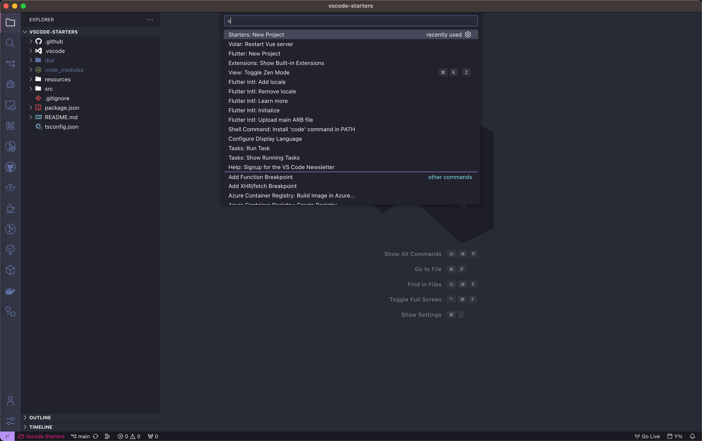
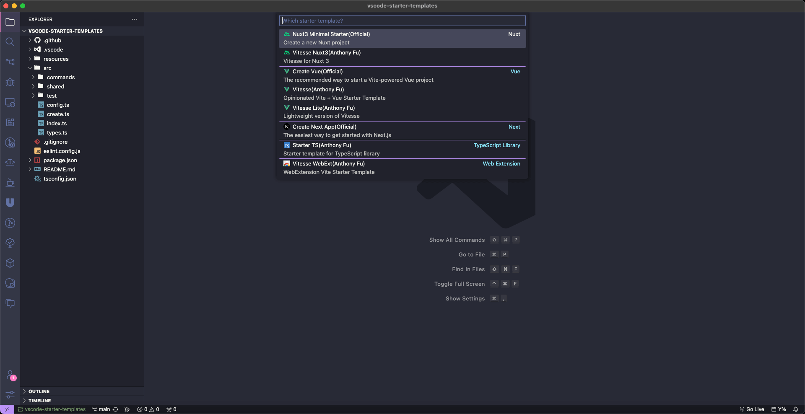

 

<h1 align="center">
Starters
</h1>

Kickstart your project with a starter in VSCode

## Motivation

- As a front-end developer, everytime before I create a new project, I have to open a terminal, enter some commands recommended in the front-end framework documentation; sometimes I even forget these commands. This whole process apparently needs more efficiency.
- In the process of developing Flutter projects, I found that I could quickly create a Flutter project through the [Dart](https://github.com/Dart-Code/Dart-Code) extension for VSCode, so I developed this extension in order to do the same when creating some front-end projects.

## Features

- Create project from starter template
- Set options for starter template
- Select your preferred package manager
- Enable or disable automatic initialization of Git
- Enable or disable automatic installation of dependencies

## Usage

<table><tr><td>Run <b><code>Starters: New Project</code></b> command to create your new project</tr></td></table>

## Support Templates

- [Nuxt3 Minimal Starter](https://github.com/nuxt/starter/tree/v3) - Create a new Nuxt project.
- [Vitesse Nuxt3](https://github.com/antfu/vitesse-nuxt3) - Vitesse for Nuxt 3.
- [Create Vue](https://github.com/vuejs/create-vue) - The recommended way to start a Vite-powered Vue project.
- [Vitesse](https://github.com/antfu/vitesse) - Opinionated starter template.
- [Vitesse Lite](https://github.com/antfu/vitesse-lite) - Lightweight version of Vitesse.
- [Create Next App](https://github.com/vercel/next.js/tree/canary/packages/create-next-app) - The easiest way to get started with Next.js.
- [Create Svelte](https://github.com/sveltejs/kit/tree/main/packages/create-svelte) - Create new SvelteKit projects.
- [Starter TS](https://github.com/antfu/starter-ts) - Starter template for TypeScript library.
- [Starter VSCode](https://github.com/antfu/starter-vscode) - Starter template for VS Code Extension.
- [Vitesse WebExt](https://github.com/antfu/vitesse-webext) - WebExtension Vite Starter Template.
- ...

## License

MIT License © 2023 [YRM](https://github.com/yrming)
